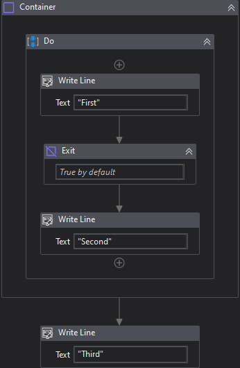
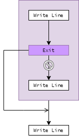

{{activity-description}}

##### Properties

{{activity-properties}}

##### Usage

This is useless if not combined with [Exit](Exit.md) activity.

They was designed to be used together and can help us to design cleaner workflows in many different situations.

Lets consider the below code:

Considering the example, only the messages *"First"* and *"Third"* will be printed out.

When we reach the **Exit** activity, the condition tells to **Container** interrupt its execution. Then, the process flow continues to the next activity.

Below is an abstraction of what happens to the execution flow:

!!! info "Related Activies"
    - [Exit](Exit.md) 
    - [Iterate](Iterate.md)
    - [Next](Next.md)