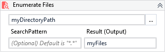

{{activity-description}}

!!! success "Versions 3.x and 2.x are compatible"

##### Properties

{{activity-properties}}

##### Usage

Returns a `IEnumerable<string>` will all file paths from a specified folder.

Use the `SearchPattern` to filter the files by its name or extension.
