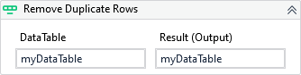

{{activity-description}}

!!! warning "Versions 3.x and 2.x incompatible"

    The XAML property DataTable is now Result.

##### Properties

{{activity-properties}}

##### Usage

The activity will remove all duplicate columns from a DataTable by testing the values of all columns. However, we can also provide a limited number of columns for this check by specifying them on `Columns` property.