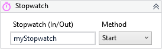

{{activity-description}}

!!! warning "Versions 3.x and 2.x incompatible"

    The XAML property StopwatchObj is now ReferenceStopwatch.

##### Properties

{{activity-properties}}

##### Usage

Stopwatch is usually used for execution time tests.

This activity is just a handy way to initialize the `System.Diagonistics.Stopwatch` and work with its different methods.

Read more about the Stopwatch class at <a href="https://docs.microsoft.com/en-us/dotnet/api/system.diagnostics.stopwatch?view=net-6.0" target="_blank">Microsoft Docs</a>