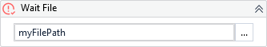

{{activity-description}}

!!! warning "Versions 3.x and 2.x incompatible"
   
    The XAML property FileInfo is now Result.

##### Properties

{{activity-properties}}

##### Usage

There are two very common situations where we can use this activity.

- Waiting for some downloading file be completed.
- Waiting for some file in use for another person or process be released.

!!! note
    For files that you **can't** determine the name, [Wait Dynamic File](Wait Dynamic File.md) suits better.

