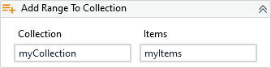

Adds a set of items to the specified collection.

!!! success "Versions 3.x and 2.x are compatible"
    
##### Properties

|Name      |Description                                    |
|----------|-----------------------------------------------|
|Collection|The collection that will receive the new items.|
|Items     |The items to be added to the collection.       |

