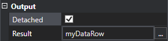
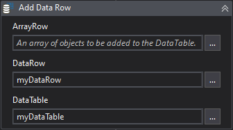
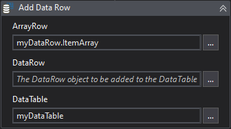

Aggregates the DataTable data by the specified function resulting in a DataRow, product of this aggregation.

##### Properties

|Name     |Description                                                                                                                            |
|---------|---------------------------------------------------------------------------------------------------------------------------------------|
|Columns  |The column indexes or column names to apply the aggregation. If not specified, the aggregation will be applied in all possible columns.|
|Detached |Returns a data row detached from the data table.                                                                                       |
|Function |The aggregate function.                                                                                                                |
|DataTable|The data table which the aggregate function will be applied.                                                                           |
|Result   |The resulting DataRow from the aggregation.                                                                                            |

!!! note
    Some aggregate functions are applied just to numeric values while others are applied to all value types, e.g. DistinctCount.

##### Usage

Let's consider the below input DataTable for instance:

| Product | Quantity | Total  |  ID  |
| ------- | -------: | -----: | ---: |
| P-001   |     1000 | 200.25 |  754 |
| P-002   |     1000 | 300.50 |  833 |
| P-003   |      500 | 400.00 |  212 |

Below is the result of **Sum** and **DistinctCoun**t aggregations:

|Function|Result DataRow
|:-:|-
|**Sum**| ``[ , 2500, 900.75, 1799 ]`` 
|**DistinctCount**| ``[ 3, 2, 3, 3 ]`` 

Note that for **Sum** aggregation, only columns with numeric values has results. 
Columns that can't be aggregate by some Function result in *null* values.

We can target specific columns by using the **Columns** property. 
For example, setting the value to: ``{"Quantity", "Total Price"}`` or ``{2, 3}``, only these columns are affected:

``[ , 2500, 900.75, ]``

By default, the output DataRow is attached to the input DataTable, but you can change it by activating the **Detached** property.

Being *attached*, means the output DataRow belongs to the input DataTable and any structural changes or data clean up in the DataTable after the use of the Aggregate Activity also affects the output DataRow.

So, if after the aggregation we resolve add two new columns to our input DataTable, the resulting DataRow will also be affected:

``BEFORE: [ , 2500, 900.75, ]`` 
``AFTER:  [ , 2500, 900.75, , , ]``

In the same way, cleaning up the input DataTable after the aggregation will also clean up our DataRow: 

``BEFORE: [ , 2500, 900.75, ]`` 
``AFTER:  [ , , , ]``

A *detached* DataRow is not affected by these input DataTable changes.

Another difference between the two modes is regarding adding the output DataRow to the input DataTable.

While in attached mode you can directly add the DataRow:

In *detached* mode you need to pass the output DataRow as an array of objects, you can do it by accessing the *.ItemArray* property.

