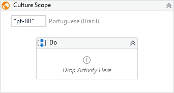

A container that allows you to run a set of activities over a different culture.

!!! success "Versions 3.x and 2.x are compatible"
    
##### Properties

|Name       |Description                                        |
|-----------|---------------------------------------------------|
|CultureName|The desired culture, eg.: en-US, pt-BR, jp-JP, etc.|

