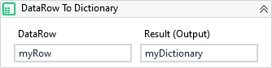

Converts a DataRow to Dictionary.

!!! warning "Versions 3.x and 2.x incompatible"

    The XAML property OutputDictionary is now Result.

##### Properties

|Name        |Description           |
|------------|----------------------|
|InputDataRow|The input DataRow.    |
|Result      |The output Dictionary.|

##### Usage

When we need to iterate through a DataTable rows and add them to an Orchestrator Queue we can convert each DataRow to Dicionary and then, pass it to *.ItemInformationCollection* property of the UiPath's *AddQueueItem* activity.
