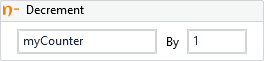

Decrements the value of a variable by the specified decrement value.

!!! success "Versions 3.x and 2.x are compatible"
    
##### Properties

|Name    |Description               |
|--------|--------------------------|
|Value   |The decrement value.      |
|Variable|The variable to decrement.|

