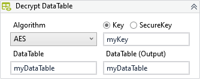

Decrypts the data of a DataTable using the specified algorithm and key.

##### Properties

|Name              |Description                                                                                                                                                                                                                                                                     |
|------------------|--------------------------------------------------------------------------------------------------------------------------------------------------------------------------------------------------------------------------------------------------------------------------------|
|Algorithm         |The decrypt algorithm to be used by this activity.                                                                                                                                                                                                                              |
|Columns           |The column indexes or column names to be decrypted.                                                                                                                                                                                                                             |
|InputDataTable    |The DataTable to be decrypted.                                                                                                                                                                                                                                                  |
|Iterations        |The number of iterations to be used in operation. The default and minimum recommended is 1000.                                                                                                                                                                                  |
|OutputDataTable   |The decrypted DataTable.                                                                                                                                                                                                                                                        |
|ParallelProcessing|Uses parallel processing to scan through the DataTable and decrypt the data. Although this can drastically increase the processing speed, the rows in the resulting DataTable may have its order changed. Combine it with Sort property to reorder the DataTable when necessary.|
|Sort              |Sets the sort column or columns, and sort order for the output DataTable. The value must be a string that contains the column name followed by "ASC" (ascending) or "DESC" (descending). Columns are sorted ascending by default. Multiple columns can be separated by commas.  |
|TextEncoding      |The encoding used to interpret the data and key.                                                                                                                                                                                                                                |

