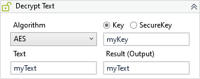

Decrypts the text using the specified algorithm and key.

##### Properties

|Name        |Description                                                                                   |
|------------|----------------------------------------------------------------------------------------------|
|Algorithm   |The decrypt algorithm to be used by this activity.                                            |
|Iterations  |The number of iterations to be used in operation. The default and minimum recommended is 1000.|
|Result      |The decrypted text.                                                                           |
|TextEncoding|The encoding used to interpret the text and key.                                              |
|Text        |The text to be decrypted.                                                                     |

