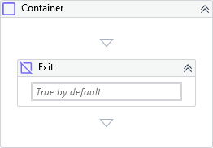

Exits from the Container or Iterate Activities interrupting any child executions after it.

!!! success "Versions 3.x and 2.x are compatible"
    
##### Properties

|Name     |Description                                                                            |
|---------|---------------------------------------------------------------------------------------|
|Condition|Condition which determines if the activity will be evaluated. If empty it assumes True.|

##### Usage

The activity can be used inside a **Container** or **Iterate** activities.

We can use the property `Condition` by providing a boolean expression or variable to determine if the execution should exit from the **Container** or **Iterate** activities.

If not specified anything to `Condition`, it assumes `True` by default.

!!! info "Related Activies"
    - [Container](Container.md) 
    - [Iterate](Iterate.md)
    - [Next](Next.md)
