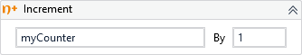

Increments the value of a variable by the specified increment value.

!!! success "Versions 3.x and 2.x are compatible"
    
##### Properties

|Name    |Description                    |
|--------|-------------------------------|
|Value   |The increment value.           |
|Variable|The variable to be incremented.|

