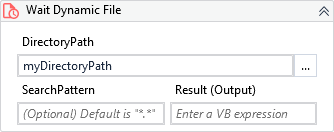

Waits until an unknown file be available by monitoring a specified folder.

!!! warning "Versions 3.x and 2.x incompatible"

    The XAML property AfterCreationTime is no longer valid.
    
    The XAML property FileInfo is now Result.

##### Properties

=== "3.x"

    |Name         |Description                                                                                                                                                                                                                                                                   |
    |-------------|------------------------------------------------------------------------------------------------------------------------------------------------------------------------------------------------------------------------------------------------------------------------------|
    |DirectoryPath|The directory to be monitored.                                                                                                                                                                                                                                                |
    |FileInfo     |Returns the information about the file.                                                                                                                                                                                                                                       |
    |Interval     |Specifies the amount of time (in milliseconds) for the file re-check. Any values out of the range of 100-20000 milliseconds is reseted to its nearest limit. The default value is 500.                                                                                        |
    |SearchPattern|The search string to match against the names of files in path. This parameter can contain a combination of valid literal path and wildcard (\* and ?) characters, but it doesn't support regular expressions. It also supports a collection of strings. Default value is "\*.\*".|
    |Timeout      |The maximum timeout to wait in milliseconds.                                                                                                                                                                                                                                  |

=== "2.x"

    |Name             |Description                                                                                                                                                                                                                                                                   |
    |-----------------|------------------------------------------------------------------------------------------------------------------------------------------------------------------------------------------------------------------------------------------------------------------------------|
    |AfterCreationTime|Determines from what creation time the file should be considered.                                                                                                                                                                                                             |
    |DirectoryPath    |The directory to be monitored.                                                                                                                                                                                                                                                |
    |FileInfo         |Returns the information about the file.                                                                                                                                                                                                                                       |
    |Interval         |Specifies the amount of time (in milliseconds) for the file re-check. Any values out of the range of 100-30000 milliseconds is reseted to its nearest limit. The default value is 500.                                                                                        |
    |SearchPattern    |The search string to match against the names of files in path. This parameter can contain a combination of valid literal path and wildcard (\* and ?) characters, but it doesn't support regular expressions. It also supports a collection of strings. Default value is "\*.\*".|
    |Timeout          |The maximum timeout to wait in milliseconds.                                                                                                                                                                                                                                  |

    
##### Usage

We can use this activity when we need to wait for a file be available which we *don't know* what is the file name.

The activity monitors a specific folder and as soon as a file become available considering all parameters specified in the activity, it returns the information of the file.

!!! note
    For files that you **can** determine the name, [Wait File](Wait File.md) suits better.
