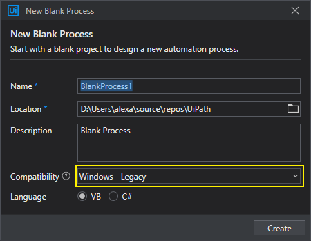

# Getting Started (UiPath)

For this documentation, the screenshots refers to UiPath Community 2021.10.3. Your interface may differ dependent of the version that you are using.

## New Project

When creating a new project, make sure that you are using Windows Legacy on Compability options.

Older versions of UiPath does not have this option and you don't need to worry about.

New compability options will be supported in future releases when possible.

## Installing Autossential

Once in your project, click on manage packages.

Search for Autossential, and install it.

Now you should be able to find the Autossential category in the Activites panel:

